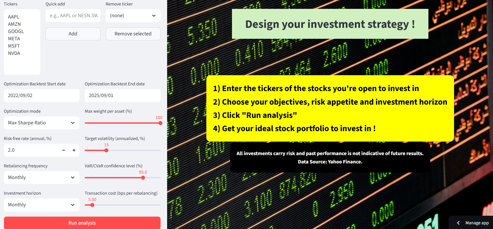
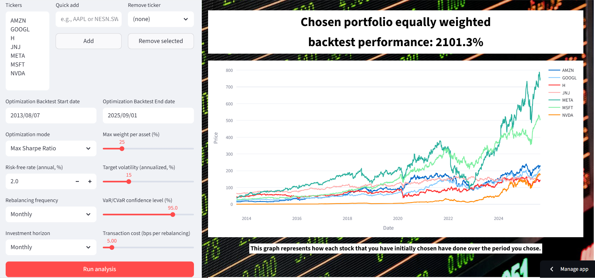
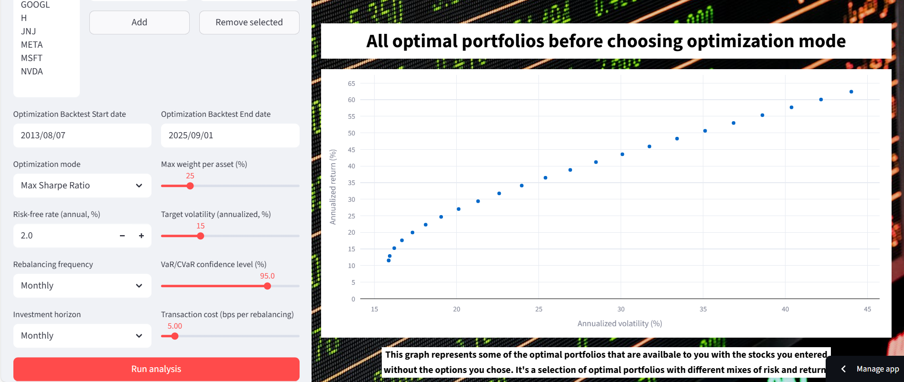
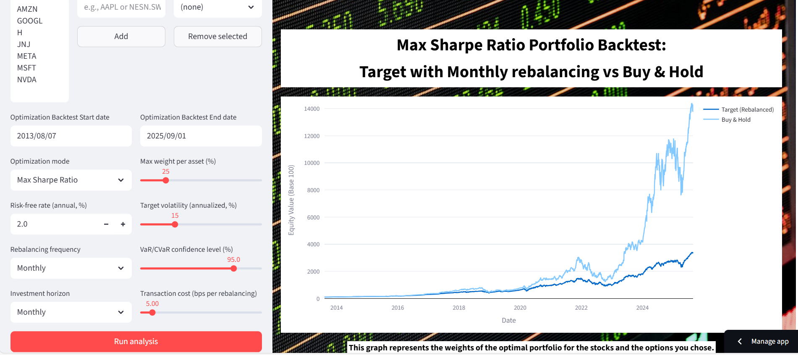
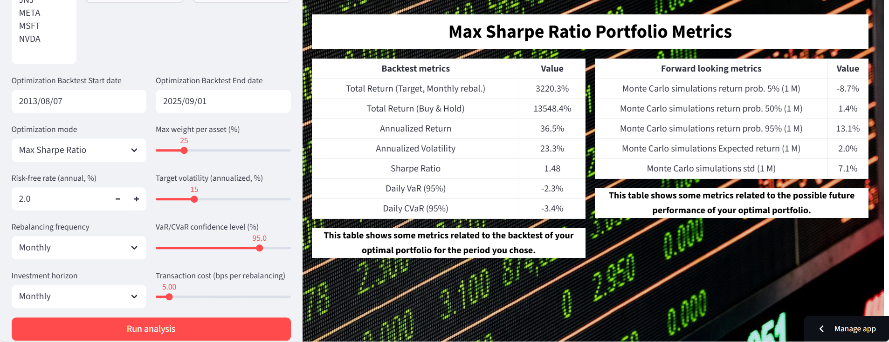

# 📊 Portfolio Optimization & Risk Dashboard

Here is my interactive dashboard for portfolio optimization, risk analysis, Monte Carlo simulations and backtesting.  
Built with Python and Streamlit, this project brings **quantitative finance** concepts to life letting users explore and compare investment strategies in real time.
Whether you're a trader, an investor or a recruiter curious about my technical & financial skills, this dashboard shows how I combine **data science, portfolio theory and modern deployment practices** to build tools that solve real-world problems.

---

## 🌐 [Live Demo](https://portfolio-optimizer-fchaillie.fly.dev)


---

### 🌟 What makes it special?
- 📊 **Dynamic Portfolio Optimization** — Mean-Variance, CVaR and Target Volatility models at your fingertips.  
- 🎲 **Monte Carlo Simulations** — Explore thousands of portfolio scenarios instantly.  
- 🔄 **Backtesting Engine** — See how strategies would have performed historically.  
- 🎨 **Polished UI** — Simple graphs and tables making finance insights easy to understand.  
- ☁️ **Easy Access** — Try it online via Streamlit Cloud or deploy it anywhere via Docker in just one command.  

---

## 🖼️ Screenshots

📌 Suggested places to add visuals:  
- Dashboard home


- Equally weighted chosen portfolio backtest performance


- Efficient Frontier


- Optimized portfolio backtest performance 


- Optimized portfolio backtest and forward looking (Monte Carlo) metrics 



---

## ⚡ Quick Start

### 1️⃣ Option A — Run Online
Fastest way: click the badgelink aboveat the top ☝️  
No installation required.

---

### 2️⃣ Option B — Run Locally with Docker

Clone the repo and build the container:

```bash
git clone https://github.com/<your-username>/portfolio-optimizer.git
cd portfolio-optimizer
docker build -t portfolio-opt .
docker run -p 8501:8501 portfolio-opt
```

Then open [http://localhost:8501](http://localhost:8501) 🎉

---

## 🧪 Testing

Run the unit tests with:

```bash
pytest -v
```

These tests validate:  
- Optimizers output valid weight vectors  
- Backtest logic runs on toy data  
- Streamlit app loads without errors  

CI (GitHub Actions) automatically runs tests on every push.

---

## 🛠️ Tech Stack

- **Python** (3.11)  
- **Streamlit** (UI)  
- **PyPortfolioOpt** (classical optimizers)  
- **Riskfolio-Lib** (CVaR, HRP)  
- **Pandas / NumPy / SciPy**  
- **Plotly / Matplotlib**  
- **Docker** (deployment)  
- **GitHub Actions** (CI)  

---

## 📂 Project Structure

```
├── app.py                # Streamlit app entry point
├── optimizers.py         # Mean-Variance, HRP, CVaR functions
├── backtest.py           # Rolling window backtest engine
├── montecarlo.py         # Monte Carlo simulations
├── metrics.py            # Risk & performance metrics
├── tests/                # Unit tests (pytest)
├── requirements.txt
├── Dockerfile
├── docker-compose.yml
└── README.md
```

---

## 📜 License

This project is licensed under the MIT License.
